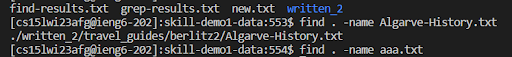
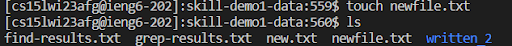
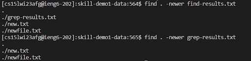
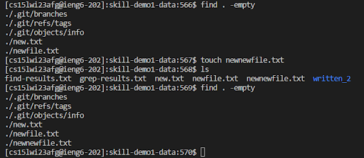

**Find**
----------------------------------------------------------------------------------------
* name demo: search for files named demo.

you can find the name of the file easily by using find -name command.

* iname demo:Search for files named demo irrespective of upper/lower case.

You can find the name of the file without concerning upper/lower case.
 

* newer file: Search for files that were modified/created after ‘file’.

You can easily find the files which is created after the original files.
 

* empty : The -empty option is used to search for empty files and directories.

You can easily find the empty files.
 

-----------------------------------------------------------------------------------------
* cited 
“Linux Tutorials | find command | GeeksforGeeks”YouTube uploaded by GeeksforGeeks 9,Apr, 2020 https://www.youtube.com/watch?v=oPdFGUrq-XQ  
