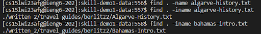

**Find**
----------------------------------------------------------------------------------------
* name demo: search for files named demo.
 

* iname demo:Search for files named demo irrespective of upper/lower case.
* 

* newer file: Search for files that were modified/created after ‘file’.
* 
* 

* empty : The -empty option is used to search for empty files and directories.
* 
-----------------------------------------------------------------------------------------
* cited 
“Linux Tutorials | find command | GeeksforGeeks”YouTube uploaded by GeeksforGeeks 9,Apr, 2020 https://www.youtube.com/watch?v=oPdFGUrq-XQ  
