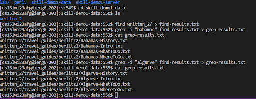
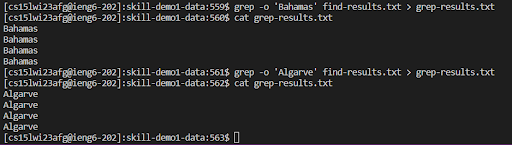
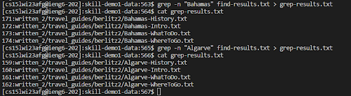
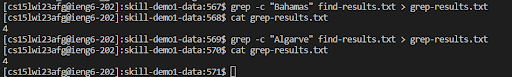

# grep
============================================================================================
grep -i: The -i option in grep stands for "ignore case." When you use the 
-i option with grep, it tells the command to search for a specified pattern
without considering the case of the letters in the pattern.

I used grep -i so that I can find the txt file which contains “Bahamas” and “Algarve” 
without considering upper or lowercase letters.

--------------------------------------------------------------------------------------------

grep -o:The grep -o command in Linux is used to print only the matched parts of a line.
It works by searching for a specified pattern or regular expression in a file or 
input stream and then printing only the parts of the line that match the pattern.

I used grep -o ‘Bahamas’ (‘Algarve’) and if grep finds a match, it prints only 
the matched part of the line and moves on to the next line.

----------------------------------------------------------------------------------------------

grep -n: The -n option in grep is used to display the line numbers of
the matched lines. Here's how it works:

In this example grep found four lines containing the word “Bahamas”(“Algarve”) in the file. 
The output shows that the lines between first matching line through fourth matching line are
on line 171,172,173,174(150,151,152,153) of the file.

-----------------------------------------------------------------------------------------------

grep -c: grep -c is a command used in Linux to count the number of lines that match a given 
pattern in a file or set of files. The command syntax is as follows:

This example shows that there are four files which contain “Bahamas”(“Algarve”) in the file.

------------------------------------------------------------------------------------------------
cited "Grep." Wikibooks, 4 Sept. 2022, en.wikibooks.org/wiki/Grep. Accessed 13 Mar. 2023.

