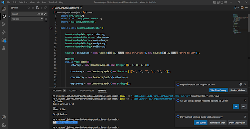
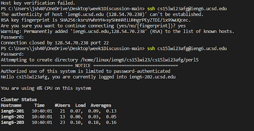
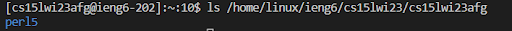

# cse15L lab report 1
## Visual Studio Code

* visit the visualstudio Code website [Link](https://code.visualstudio.com/) and download it on the computer.
* Once the VS Code setup create new folder on the preferred location
* Create a new file by clicking “File” - “New Text File” 
* Once you’re done typing, choose “File” then “Save” then change type to “Java” and save the file

## Remotely Connecting
1. Install git for window.
2. Install git bash in vs code.
3. Then, to use **ssh**,open a terminal in VScode.
4. your command look like this **$ ssh cs15lwi23zz@ieng6.ucsd.edu** replace **zz** to your specific account.
5. If you first connect to the server you will get message something like **ssh cs15lwi23zz@ieng6.ucsd.edu
The authenticity of host 'ieng6.ucsd.edu (128.54.70.227)' can't be established.
RSA key fingerprint is SHA256:ksruYwhnYH+sySHnHAtLUHngrPEyZTDl/1x99wUQcec.
Are you sure you wnant to continue connecting (yes/no/[fingerprint])?**
6. Type yes if then your terminal will be connected to a computer.

*The account that I have to enter was different from the ucsd account so I struggled at first. Also the password was not shown on the screen so it was hard to find the problem.*

## Run Some Commands
*.you can use command on your computer for example cd<path> used to switch the current working directory to the given path.
*I use the ls <directory> command to list the contents of the other directory.*

