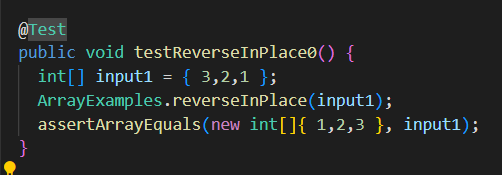

# cse15l lab 2

**what does -cp do?**
Command Cp allows you to create a copy of the contents of the file.
--------------------------------------------------------------------

**What happen if I run mac command on window?**
it gives result like this image

---------------------------------------------------------------------
**what was the failure-inducing input (the test)? What was the symptom (the output when the test failed)?**

In this code The initial array is not stored so after the middle number of i the array will not be changed to the result of the initial array.

Expected value: 1,2,3
Output 3,2,3

**Fixed version**

The reversed method also have a bug because of the same reason as reversedInPlace method.

----------------------------------------------------------------------
For averageWithoutLowest Come up with a high level description of a test that your lab partner should implement (without using any code!). Also include: Which symptom/bug is this testing for? Why is this test useful? 

Let the array with two or more lowest numbers and test it to check whether the duplicated lowested numbers will be ignored. (ex input 11145 expected value 4.0 actual value 2.4.)

--------------------------------------------------------------------

