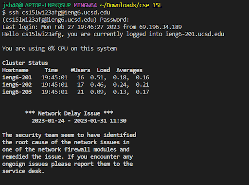
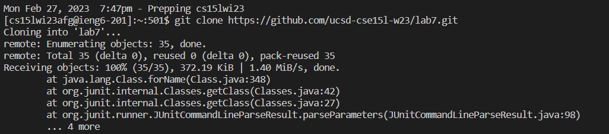
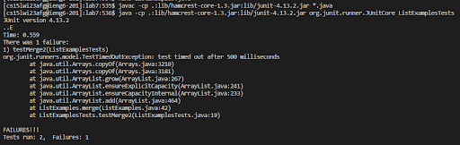
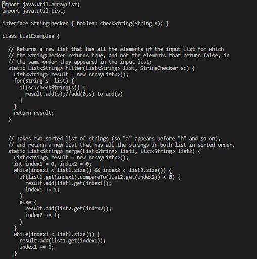
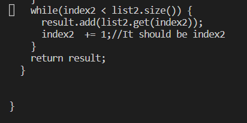
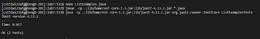
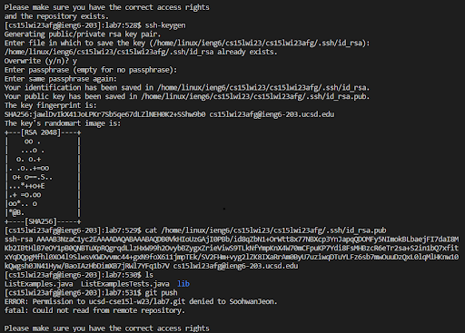
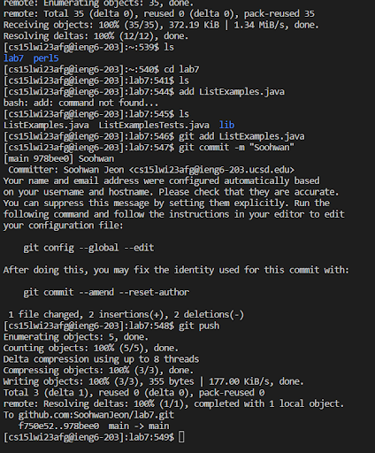
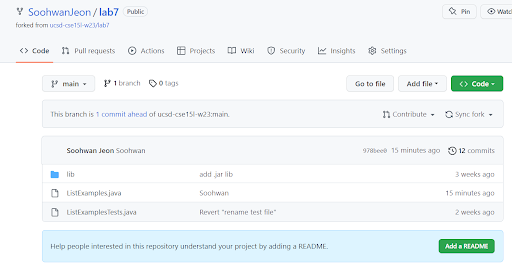
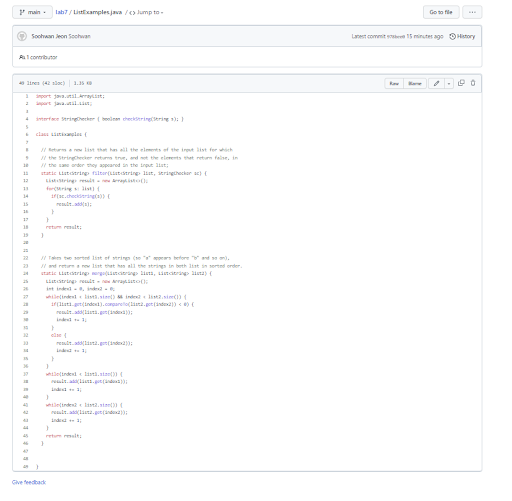

1. Log into ieng6

To log in to my account I pressed 
```
# code block
ssh cs15lwi23afg@ieng6.ucsd.edu
pw:
```


----------------------------------------------------------------------------------------------------------------------------
2. Clone your fork of the repository from your Github account
I use gitclone to clone the lab7 file in to my repository

```
# code block
gitclone git@github.com:ucsd-cse15l-w23/lab7.git
```



----------------------------------------------------------------------------------------------------------------------------
3. Run the tests, demonstrating that they fail

```
# code block
javac -cp .:lib/hamcrest-core-1.3.jar:lib/junit-4.13.2.jar *.java <enter>
java -cp .:lib/hamcrest-core-1.3.jar:lib/junit-4.13.2.jar org.junit.runner.JUnitCore ListExamples <enter>
```

to test the junit test



----------------------------------------------------------------------------------------------------------------------------
4. Edit the code file to fix the failing test
I used nano command to edit the file through terminal 
keyword nano help to edit the file.

In the filter method, result.add(0, s) inserts elements at the beginning of the list so 
the method is not return list which is same order as original list so I change result.add(0, s)
to result.add(s) 
```
# code block
nano ListExamples.java 
press the down and right keyboard to move the cursor to a result.add(0, s);
<down>,<down>,<down>,<down>,<down>,<right>,<right>,<right>,<right>,<right>,<right>,<right>

delete 0, 
<delete>,<delete>

```



Also in the 'merge' method last while loop index1 should be index2 because 
if the index2 is not increased then it can be infinite loop

```
# code block
press the down and right keyboard to move the cursor to a while loop which is in merge function.
<down>,<down>,<down>,<down>,<down>,<down>,<down>,<down>,<right>,<right>,<right>,<right>,<right>,<right>,<right>

change index1 to index2.
<delete>,press 2.

```



After finish editing the file I save the file by using <^o> and exit by typing <^x>
```
# code block
save 
<^o>
exit
<^x>
```

----------------------------------------------------------------------------------------------------------------------------
5. Run the tests, demonstrating that they now succeed


Use javac -cp .:lib/hamcrest-core-1.3.jar:lib/junit-4.13.2.jar *.java
and java -cp .:lib/hamcrest-core-1.3.jar:lib/junit-4.13.2.jar org.junit.runner.JUnitCore ListExamples 
to run the Junit test again and check all test is run successfully.

```
# code block
javac -cp .:lib/hamcrest-core-1.3.jar:lib/junit-4.13.2.jar *.java <enter>
java -cp .:lib/hamcrest-core-1.3.jar:lib/junit-4.13.2.jar org.junit.runner.JUnitCore ListExamples <enter>
```


------------------------------------------------------------------------------------------------------------------------------
6. Commit and push the resulting change to your Github account 

Use Git clone to clone the path to local computer

Use Git commit to send local git

Lastly Git push to git 
```
# code block
Run the command ssh-keygen <enter>
press Enter until the command completes and shows the “randomart image”
<enter>,<enter>,<enter>
(/home/linux/ieng6/cs15lwi23/cs15lwi23afg/.ssh/id_rsa):
Use Git clone to clone the path to local computer
git clone git@github.com:SoohwanJeon/lab7.git <enter>
git add ListExample.java <enter>
Use Git commit to send local git
git commit -m "Soohwan" <enter>
Lastly Git push to git 
git push <enter>
```






**result**








